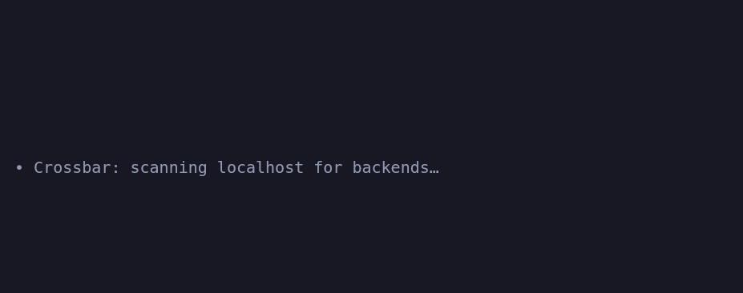

# Crossbar

[](https://github.com/Hypabolic/Crossbar/actions/workflows/ci.yml)
[](https://www.npmjs.com/package/@hypabolic/crossbar)

**Effortless local & self-hosted model backends for the Pi coding agent.**

Crossbar is an extension for the [Pi coding agent](https://github.com/earendil-works/pi) that makes
wiring Pi to *any* local or self-hosted model backend effortless — zero hand-edited JSON, all setup
inside Pi's TUI, with auto-discovery, multi-server support, live "currently loaded" indicators, and
in-place model switching.

> Built by [Hypabolic](https://github.com/hypabolic).



---

## Why Crossbar

Existing connectors stop short: manual config files, a single server at a time, Ollama-only discovery,
or hardcoded model lists. Crossbar beats them on three axes:

1. **Widest backend support** — Ollama, LM Studio, llama.cpp, llama-swap, vLLM, OpenAI, Anthropic, plus
   a generic adapter for the OpenAI-compatible long tail (TabbyAPI, KoboldCpp, text-generation-webui,
   Jan, llamafile, …).
2. **Easiest onboarding** — `/crossbar` auto-discovers running servers on localhost and registers them.
   No JSON. API-key *and* no-auth endpoints, with a connection test before you commit.
3. **Highest-fidelity UX** — multiple simultaneous servers, a live loaded-model widget, and capability-
   driven model switching that gracefully hides what a backend can't do.

## Supported backends

| Backend | Discover | Loaded indicator | Switch model | Load/Unload | Auth |
|---|:--:|:--:|:--:|:--:|---|
| **Ollama** | ✅ | ✅ live | ✅ implicit | ✅ | none (local) |
| **LM Studio** | ✅ | ✅ live | ✅ JIT | ✅ | optional key |
| **llama.cpp** (`llama-server`) | ✅ | ✅ (single) | ❌¹ | ❌ | optional key |
| **llama-swap** | ✅ | ✅ live | ✅ proxy swap | ✅ | optional key |
| **vLLM** | ✅ | last-known | ❌¹ | ❌ | optional key |
| **OpenAI** | configured | — | pick model | — | API key |
| **Anthropic** | configured | last-known | pick model | — | API key |
| **Generic OpenAI-compatible** | ✅ (fallback) | last-known | ❌ | ❌ | optional key |

¹ Single model per instance. Run **llama-swap** in front of `llama-server`/vLLM to unlock switching —
Crossbar detects it automatically and prefers it.

Full endpoint-level detail is in [`CAPABILITY-MATRIX.md`](./CAPABILITY-MATRIX.md); research notes and
Pi-integration citations are in [`RESEARCH.md`](./RESEARCH.md) and [`ARCHITECTURE.md`](./ARCHITECTURE.md).

## Install

```bash
# from npm
pi install npm:@hypabolic/crossbar

# or from git
pi install git:github.com/hypabolic/crossbar

# or a local checkout
pi install /path/to/crossbar
```

Then start Pi and run `/crossbar`.

## Usage

- **`/crossbar`** (alias **`/local`**) — open the onboarding overlay: pick from auto-discovered servers
  or add one manually (URL + optional API key / no-auth toggle), test the connection, choose a model,
  and save.
- **Auto-discovery** runs on session start: reachable no-auth servers on localhost are registered
  automatically; keyed servers are surfaced with a prompt to add them.
- Registered models appear in Pi's standard **`/model`** picker and `/login` provider list.
- The **loaded-model widget** shows what's currently resident (`●` live via introspection, `◷` with a
  `(last-known)` suffix where a backend can't report live state).

LAN discovery (beyond localhost) is **off by default** — no backend advertises over mDNS, so Crossbar
never scans your network unless you opt in.

## How it works

- **Discovery** probes localhost ports and fingerprints each server by response shape (e.g. Ollama's
  `GET /` banner, LM Studio's `/api/v0/models` state, vLLM's `/version` + `owned_by`), preferring the
  most specific match. The generic adapter is the low-confidence fallback.
- **Registration** maps discovered models onto Pi's built-in `openai-completions` / `anthropic-messages`
  providers via `pi.registerProvider` — Crossbar writes no streaming code for OpenAI-compatible servers.
- **Persistence** keeps non-secret server metadata in `~/.pi/agent/crossbar.json`; **API keys live only
  in Pi's `auth.json`** (mode `0600`), keyed by the server's provider id, exactly like Pi's own creds.

## Security

- API keys are **never** written to `crossbar.json`, never logged, and never inlined into a provider
  config — Pi resolves them from `auth.json` at request time.
- Discovery is localhost-only by default.
- Crossbar adds no telemetry.

## Development

```bash
npm install
npm run check   # tsc --noEmit
npm test        # vitest (conformance + unit + live-socket integration)
```

The `BackendAdapter` contract (`src/core/`) is the frozen boundary every adapter implements; the
conformance suite (`tests/conformance/`) validates every adapter against it, and
`tests/integration/` exercises the real discovery path over live sockets.

### CI

CI (`.github/workflows/ci.yml`) runs `tsc --noEmit` + the full test suite on every push and PR
(Node 22 & 24).

## License

[MIT](./LICENSE) © Hypabolic
